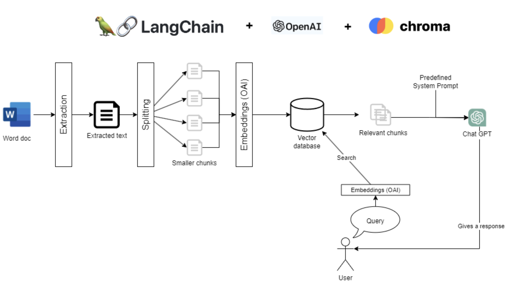

# Framework


# Limitations
At the moment it only supports PDFs. You can create other document loaders to
support other documents:
https://python.langchain.com/en/latest/modules/indexes/document_loaders.html

# Installation Process
Once you've downloaded Python, follow these steps to install Langchain, Chroma
and set up the OpenAI API:

Open a terminal or command prompt and run the following command:

```bash
  pip install -r requirements.txt
```

This will install Langchain and its dependencies as long as Chroma, a vector
database plus a little dependency to extract information out of a Word document.

# Setup OpenAI API

After signing up for an OpenAI account, you have to create an API key from you
account on the platform.openai.com web site.

# Run locally
```bash
  gradio app.py
```

Running on local URL:  http://127.0.0.1:7861

# Optional Deployment (Free and temporal for 72 hours)
To create a public link, set `share=True` in `launch()`.

In the app.py script, the last line can be replaced by:

```bash
demo.queue(concurrency_count=5, max_size=20).launch(share=True)
```

This will generate a public url that deploys your code only for 72 hours.
The url will be displayed in the terminal. You will be able to access that URL
from any computer.
